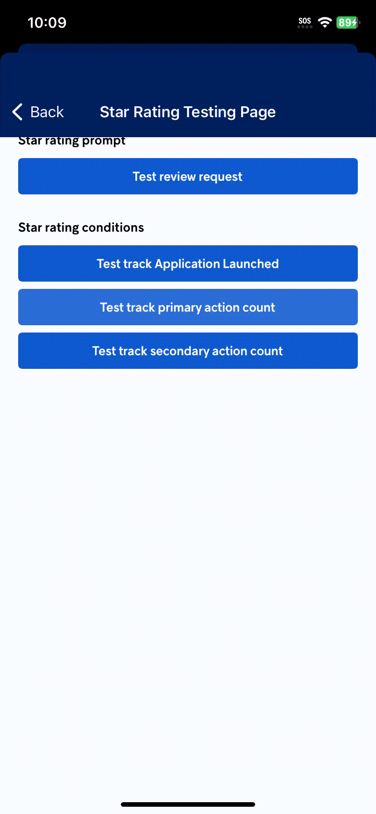

# Review Service

This repository introduces abstractions around native review capabilities to ease code sharing and testability.
It also introduces business logic to quickly configure conditions and state tracking to prompt for reviews at the right moment.

[](LICENSE)  

## Before Getting Started

Before getting started, please read the [Android](https://developer.android.com/guide/playcore/in-app-review) and [iOS](https://developer.apple.com/design/human-interface-guidelines/ratings-and-reviews) application review documentation.

## Getting Started

1. Add the `ReviewService` and `ReviewSerivce.NativePrompters` NuGet packages to your projects (Windows, Android and iOS).
   > 💡 If you need to implement more platforms or create custom implementations, you can use the `ReviewService.Abstractions` NuGet package.

2. Create an instance of `ReviewService`. We'll cover dependency injection in details later on in this documentation.
   ``` cs
   using ReviewService;

   var reviewConditionsBuilder = ReviewConditionsBuilder.Empty()
      .MinimumPrimaryActionsCompleted(1);

   var reviewService = new ReviewService<ReviewSettings>(
       logger: null,
       reviewPrompter: new ReviewPrompter(logger: null),
       reviewSettingsSource: new MemoryReviewSettingsSource(),
       reviewConditionsBuilder: reviewConditionsBuilder
   )
   ```

3. Use the service.
   - Update the review settings based on application events.
      ``` cs
      using ReviewService;

      private readonly IReviewService<ReviewSettings> _reviewService;

      public async Task DoPrimaryAction(CancellationToken ct)
      {
          // Do Primary Action.

          // Track this action.
          await _reviewService.TrackPrimaryActionCompleted(ct)
      }
      ```
   - Use the service to request review.
      ``` cs
      using ReviewService;

      private readonly IReviewService<ReviewSettings> _reviewService;

      public async Task OnCompletedImportantFlow(CancellationToken ct)
      {
          // Do Meaningful Task.

          // Check if all conditions are satisfied and prompt for review if they are.
          await _reviewService.TryRequestReview(ct);
      }
      ```

   
   

## Next Steps

### Persisting Review Settings

`MemoryReviewSettingsSource` is great for automated testing but should not be the implementation of choice for real use-cases. Instead, you should create your own implementation that persists data on the device (so that review settings don't reset when you kill the app).

``` cs
using ReviewService;

/// <summary>
/// Storage implementation of <see cref="IReviewSettingsSource{TReviewSettings}"/>.
/// </summary>
/// <typeparam name="TReviewSettings">The type of the persisted object.</typeparam>
public sealed class StorageReviewSettingsSource<TReviewSettings> : IReviewSettingsSource<TReviewSettings>
    where TReviewSettings : ReviewSettings
{
    /// <inheritdoc/>
    public Task<TReviewSettings> Read(CancellationToken ct)
    {
        // TODO: Return stored review settings.
    }

    /// <inheritdoc/>
    public Task Write(CancellationToken ct, TReviewSettings reviewSettings)
    {
        // TODO: Update stored review settings.
    }
}
```

### Using Dependency Injection

Here is a simple code that does dependency injection using `Microsoft.Extensions.DependencyInjection` and `Microsoft.Extensions.Hosting`.

``` cs
using Microsoft.Extensions.DependencyInjection;
using Microsoft.Extensions.Hosting;
using ReviewService;

var host = new HostBuilder()
    .ConfigureServices(serviceCollection => serviceCollection
        .AddSingleton<IReviewPrompter, ReviewPrompter>()
        .AddSingleton<IReviewSettingsSource<ReviewSettingsCustom>, ReviewSettingsSource>()
        .AddTransient(s => ReviewConditionsBuilder
            .Default<ReviewSettingsCustom>()
        )
        .AddSingleton<IReviewService<ReviewSettingsCustom>, ReviewService<ReviewSettingsCustom>>()
    )
    .Build();
```

> 💡 We recommend that you define your own interface that wraps `IReviewService<YouChoiceOfReviewSettings>` to make the usage code leaner and ease any potential refactorings.
> ```csharp
> /// <summary>
> /// This interface wraps <see cref="IReviewService{TReviewSettings}"/> so that you don't have to repeat the generic parameter everywhere that you would use the review service.
> /// In other words, you should use this interface in the app instead of <see cref="IReviewService{TReviewSettings}"/> because it's leaner.
> /// </summary>
> /// <remarks>
> /// If you would change <see cref="ReviewSettings"/> for a custom type, using this interface allows you to minimize any refactoring effort by limiting it to this interface and the associated adapter.
> /// </remarks>
> public interface IReviewService : IReviewService<ReviewSettings>
> {
> }
> ```
> Here's a full example.
> ```csharp
> public static class ReviewConfiguration
> {
> 	public static IServiceCollection AddReviewServices(this IServiceCollection services)
> 	{
> 		return services
> 			.AddTransient(s => ReviewConditionsBuilder
> 				.Empty()
> 				.MinimumPrimaryActionsCompleted(3)
> 			)
> 			.AddSingleton<IReviewPrompter, LoggingReviewPrompter>()
> 			.AddSingleton<IReviewSettingsSource<ReviewSettings>, MemoryReviewSettingsSource<ReviewSettings>>()
> 			.AddSingleton<IReviewService<ReviewSettings>, ReviewService<ReviewSettings>>()
> 			.AddSingleton<IReviewService, ReviewServiceAdapter>();
> 	}
> 
> 	private sealed class ReviewServiceAdapter : IReviewService
> 	{
> 		private readonly IReviewService<ReviewSettings> _reviewService;
> 
> 		public ReviewServiceAdapter(IReviewService<ReviewSettings> reviewService)
> 		{
> 			_reviewService = reviewService;
> 		}
> 
> 		public Task<bool> GetAreConditionsSatisfied(CancellationToken ct) => _reviewService.GetAreConditionsSatisfied(ct);
> 
> 		public Task TryRequestReview(CancellationToken ct) => _reviewService.TryRequestReview(ct);
> 
> 		public Task UpdateReviewSettings(CancellationToken ct, Func<ReviewSettings, ReviewSettings> updateFunction) => _reviewService.UpdateReviewSettings(ct, updateFunction);
> 
> ```

## Features

Now that everything is setup, Let's see what else we can do!

### Tack Application Events

To track the provided review settings you can use the following `IReviewService` extensions.
> 💡 The review request count and the last review request are automatically tracked by the service.

- [TrackApplicationLaunched](https://github.com/nventive/ReviewService/blob/a78e37c7e9b6fbe07ba1fec5d0f2b3b2f31bf356/src/ReviewService.Abstractions/ReviewService.Extensions.cs#L20) : Tracks that the application was launched (Also tracks if it's the first launch).
- [TrackPrimaryActionCompleted](https://github.com/nventive/ReviewService/blob/a78e37c7e9b6fbe07ba1fec5d0f2b3b2f31bf356/src/ReviewService.Abstractions/ReviewService.Extensions.cs#L45) : Tracks that a primary action was completed.
- [TrackSecondaryActionCompleted](https://github.com/nventive/ReviewService/blob/a78e37c7e9b6fbe07ba1fec5d0f2b3b2f31bf356/src/ReviewService.Abstractions/ReviewService.Extensions.cs#L61) : Tracks that a secondary action was completed.

### Customize Tracking Data

If you need custom conditions for your application, you have to create another record that inherits from `ReviewSettings`.

 ``` cs
using ReviewService;

/// <summary>
/// The custom review prompt settings used for prompt conditions.
/// </summary>
public record ReviewSettingsCustom : ReviewSettings
{
    /// <summary>
    /// Gets or sets if the application onboarding has been completed.
    /// </summary>
    public bool HasCompletedOnboarding { get; init; }
}
```

### Add Tracking for Custom Application Events

To track your custom review settings, you can create extensions for `IReviewService` and be sure to make them generic so they are usable with custom review settings.

``` cs
using ReviewService;

/// <summary>
/// Extensions of <see cref="IReviewService{TReviewSettings}"/>.
/// </summary>
public static class ReviewServiceExtensions
{
    /// <summary>
    /// Tracks that the application onboarding has been completed.
    /// </summary>
    /// <typeparam name="TReviewSettings">The type of the object that we use for tracking.</typeparam>
    /// <param name="reviewService"><see cref="IReviewService{TReviewSettings}"/>.</param>
    /// <param name="ct">The cancellation token.</param>
    /// <returns><see cref="Task"/>.</returns>
    public static async Task TrackOnboardingCompleted<TReviewSettings>(this IReviewService<TReviewSettings> reviewService, CancellationToken ct)
        where TReviewSettings : ReviewSettingsCustom
    {
        await reviewService.UpdateReviewSettings(ct, reviewSettings =>
        {
            return reviewSettings with { HasCompletedOnboarding = reviewSettings.HasCompletedOnboarding };
        });
    }
}
```

#### Built-in Tracking Data

- [PrimaryActionCompletedCount](https://github.com/nventive/ReviewService/blob/1484f946c60e2bf1cb86b27faa60c148a1e56d45/src/ReviewService.Abstractions/ReviewSettings.cs#L13) : The number of primary actions completed.
- [SecondaryActionCompletedCount](https://github.com/nventive/ReviewService/blob/1484f946c60e2bf1cb86b27faa60c148a1e56d45/src/ReviewService.Abstractions/ReviewSettings.cs#L18) : The number of secondary actions completed.
- [ApplicationLaunchCount](https://github.com/nventive/ReviewService/blob/1484f946c60e2bf1cb86b27faa60c148a1e56d45/src/ReviewService.Abstractions/ReviewSettings.cs#L23) : The number of times the application has been launched.
- [FirstApplicationLaunch](https://github.com/nventive/ReviewService/blob/1484f946c60e2bf1cb86b27faa60c148a1e56d45/src/ReviewService.Abstractions/ReviewSettings.cs#L28) : When the application first started.
- [RequestCount](https://github.com/nventive/ReviewService/blob/1484f946c60e2bf1cb86b27faa60c148a1e56d45/src/ReviewService.Abstractions/ReviewSettings.cs#L33) : The number of review requested.
- [LastRequest](https://github.com/nventive/ReviewService/blob/1484f946c60e2bf1cb86b27faa60c148a1e56d45/src/ReviewService.Abstractions/ReviewSettings.cs#L38) : When the last review was requested.

### Configure Conditions

If you want to use our default review conditions, you can use `ReviewConditionsBuilder.Default()` and pass it to the `ReviewService` constructor, or register it as a transient dependency when using dependency injection. Please note that our review conditions are also generic, so they can be used with custom review settings too.

The `ReviewConditionsBuilder.Default()` extension method uses the following conditions.
- **3** application launches required.
- **2** completed primary actions.
- **5** days since the first application launch.
- **15** days since the last review request.

#### Built-in Conditions

- [MinimumPrimaryActionsCompleted](https://github.com/nventive/ReviewService/blob/a78e37c7e9b6fbe07ba1fec5d0f2b3b2f31bf356/src/ReviewService.Abstractions/ReviewConditionsBuilder.Extensions.cs#L17) : Make sure that it prompts for review only if the number of completed primary actions meets the minimum.
- [MinimumSecondaryActionsCompleted](https://github.com/nventive/ReviewService/blob/a78e37c7e9b6fbe07ba1fec5d0f2b3b2f31bf356/src/ReviewService.Abstractions/ReviewConditionsBuilder.Extensions.cs#L33) : Make sure that it prompts for review only if the number of completed secondary actions meets the minimum.
- [MinimumApplicationLaunchCount](https://github.com/nventive/ReviewService/blob/a78e37c7e9b6fbe07ba1fec5d0f2b3b2f31bf356/src/ReviewService.Abstractions/ReviewConditionsBuilder.Extensions.cs#L49) : Make sure that it prompts for review only if the number of times the application has been launched meets the required minimum.
- [MinimumElapsedTimeSinceApplicationFirstLaunch](https://github.com/nventive/ReviewService/blob/a78e37c7e9b6fbe07ba1fec5d0f2b3b2f31bf356/src/ReviewService.Abstractions/ReviewConditionsBuilder.Extensions.cs#L65) : Make sure that it prompts for review only if the elapsed time since the first application launch meets the required minimum.
- [MinimumElapsedTimeSinceLastReviewRequest](https://github.com/nventive/ReviewService/blob/1484f946c60e2bf1cb86b27faa60c148a1e56d45/src/ReviewService.Abstractions/ReviewConditionsBuilder.Extensions.cs#L83) : Make sure that it prompts for review only if the elapsed time since the last review request meets the required minimum.
- [Custom](https://github.com/nventive/ReviewService/blob/1484f946c60e2bf1cb86b27faa60c148a1e56d45/src/ReviewService.Abstractions/ReviewConditionsBuilder.Extensions.cs#L99) : Custom condition made with a synchronous lambda function.
- [CustomAsync](https://github.com/nventive/ReviewService/blob/1484f946c60e2bf1cb86b27faa60c148a1e56d45/src/ReviewService.Abstractions/ReviewConditionsBuilder.Extensions.cs#L113) : Custom asynchronous condition made with an asynchronous lambda function.

### Add Custom Conditions

To create custom review conditions, you have to use `ReviewConditionsBuilder.Custom` and `ReviewConditionsBuilder.CustomAsync` and provide them with a function directly instead of a condition. Also you can create extensions for `IReviewConditionsBuilder` and add a new condition to the builder. To create a review condition, you can use both `SynchronousReviewCondition` and `AsynchronousReviewCondition` you need to provide them with a function.

``` cs
namespace ReviewService;

/// <summary>
/// Extensions for <see cref="IReviewConditionsBuilder{TReviewSettings}"/>.
/// </summary>
public static partial class ReviewConditionsBuilderExtensions
{
    /// <summary>
    /// The application onboarding must be completed.
    /// </summary>
    /// <typeparam name="TReviewSettings">The type of the object that we use for tracking.</typeparam>
    /// <param name="builder">The builder.</param>
    /// <returns><see cref="IReviewConditionsBuilder{TReviewSettings}"/>.</returns>
    public static IReviewConditionsBuilder<TReviewSettings> ApplicationOnboardingCompleted<TReviewSettings>(this IReviewConditionsBuilder<TReviewSettings> builder)
        where TReviewSettings : ReviewSettingsCustom
    {
        builder.Conditions.Add(new SynchronousReviewCondition<TReviewSettings>(
            (reviewSettings, currentDateTime) => reviewSettings.HasCompletedOnboarding is true)
        );
        return builder;
    }
}
```

Here is a simple code that uses the builder extensions for review conditions.

 ``` cs
var reviewConditionsBuilder = ReviewConditionsBuilder.Empty()
    .MinimumPrimaryActionsCompleted(1)
    .MinimumSecondaryActionsCompleted(1)
    .MinimumApplicationLaunchCount(1)
    .MinimumTimeElapsedSinceApplicationFirstLaunch(TimeSpan.FromDays(1))
    .Custom((reviewSettings, currentDateTime) =>
    {
        return reviewSettings.PrimaryActionCompletedCount + reviewSettings.SecondaryActionCompletedCount >= 2;
    });
```

It's possible to customize the review conditions used by the service by using `ReviewConditionsBuilder` and passing it to the `ReviewService` constructor or by injecting it as a transient when using dependency injection.

``` cs
using ReviewService;

var reviewConditionsBuilder = ReviewConditionsBuilder.Empty<ReviewSettingsCustom>()
    .ApplicationOnboardingCompleted()
    .MinimumPrimaryActionsCompleted(3)
    .MinimumApplicationLaunchCount(3)
    .MinimumTimeElapsedSinceApplicationFirstLaunch(TimeSpan.FromDays(5))
    .Custom((reviewSettings, currentDateTime) =>
    {
        return reviewSettings.PrimaryActionCompletedCount + reviewSettings.SecondaryActionCompletedCount >= 2;
    });
```

## Testing

This is what you need to know before testing and debugging this service. Please note that this may change and you should always refer to the [Apple](https://developer.apple.com/documentation/storekit/skstorereviewcontroller/3566727-requestreview#4278434) and [Android](https://developer.android.com/guide/playcore/in-app-review/test) documentation for the most up-to-date information.

### Android

- You can't test this service while debugging the application, the prompt won't show up. To test it, you need to use the [internal application sharing](https://play.google.com/console/about/internalappsharing/) or the internal testing feature in Google Play Console. See [this](https://developer.android.com/guide/playcore/in-app-review/test) for more details.
- You can't use a Google Suite account on Google Play to review an application because the prompt will not show up.

### iOS

- You can test on a real device or on a simulator.
- You can test this service only while debugging the application (It won't show up on TestFlight).

## Acknowledgements

Take a look at [StoreReviewPlugin](https://github.com/jamesmontemagno/StoreReviewPlugin) that we use to prompt for review.

## Breaking Changes

Please consult [BREAKING_CHANGES.md](BREAKING_CHANGES.md) for more information about version
history and compatibility.

## License

This project is licensed under the Apache 2.0 license - see the
[LICENSE](LICENSE) file for details.

## Contributing

Please read [CONTRIBUTING.md](CONTRIBUTING.md) for details on the process for
contributing to this project.

Be mindful of our [Code of Conduct](CODE_OF_CONDUCT.md).